# 🧠 ScaleDown Deep Research Agent

An autonomous, multi-agent research swarm designed to transform abstract queries into professional, IEEE-formatted research papers. Powered by **ScaleDown** context optimization and **LangGraph** orchestration.

---

## 🚀 Overview

The Deep Research Agent is a collaborative AI system that mimics a real-world academic research team. Unlike standard chat agents, it utilizes a specialized swarm architecture to perform parallel evidence gathering, rigorous debate, and iterative verification.

### 🏗️ Agent Swarm Architecture

The system is coordinated via a **LangGraph** state machine, ensuring logical handoffs and iterative refinement loops.

```mermaid
graph TD
    User([Research Query]) --> Researcher[🔍 Researcher Agent]
    Researcher --> Search{DuckDuckGo Search}
    Search --> Researcher
    Researcher --> Critic[⚖️ Critic Agent]
    
    Critic -- "Debate/Rejected (Low Confidence)" --> Researcher
    Critic -- "Consensus Reached (Confidence > 0.7)" --> Synthesizer[🧩 Synthesizer Agent]
    
    Synthesizer --> Writer[✍️ Writer Agent]
    Writer --> Output[📄 IEEE Research PDF]
```



---

## ⚙️ Technical Specifications

- **Multi-Agent Orchestration**: Implemented using **LangGraph** to managed complex branching and cyclic loops.
- **Inter-Agent Context Sharing**: Powered by **ScaleDown** to compress research data before passing it between specialized nodes.
- **Coordination Layer**: Employs a message queue pattern for seamless state transitions and agent handoffs.
- **Consensus Mechanisms**: Automated cross-verification between Researcher and Critic to ensure high-fidelity data before synthesis.

---

## ✨ Key Features

### 1. 🔍 Tool-Assisted Parallel Research

The **Researcher Agent** gathers empirical data and recent advancements via real-time web retrieval. It can initiate multiple search paths in parallel to cover a wider research scope.

### 2. ⚖️ Debate Simulation & Fact Verification

The **Critic Agent** acts as a senior reviewer, challenging claims and verifying source attribution. This creates a "Debate Simulation" that filters out hallucinations and low-quality evidence.

### 3. 🧩 Iterative Refinement

The workflow isn't linear—it's iterative. Agents revisit and refine their findings based on critique until a set confidence threshold (default 0.7) is met.

### 4. ✍️ IEEE-Style Report Generation

Produces high-quality PDFs matching professional academic standards:

- **Abstract—** headers & Two-column simulation.
- **Latin-1 Unicode handling** for special characters.
- **Automated Source Attribution** integration.

---

## ⚡ ScaleDown Benefits

By utilizing the ScaleDown optimization framework, the system achieves:

- **70% Token Reduction**: Context is intelligently compressed during inter-agent transfer, significantly reducing API costs.
- **Enhanced Scalability**: Enables **10+ agent conversations** simultaneously, whereas standard systems often bottleneck at 3-4 agents due to context limits.
- **5x Larger Scope**: Coordinate on massive research queries that would normally exceed the context window of standard LLMs.

---

## � Deliverables

1. **Multi-Agent System**: A fully autonomous research swarm with robust error recovery.
2. **Research Report Generator**: Automated IEEE-formatted PDF production engine.
3. **Agent Performance Dashboard**: Live tracking of iterations, confidence, and internal logs.
4. **Optimized Workflow**: A high-efficiency alternative to single-agent prompt engineering.

---

## 🛠️ Setup & Usage

### 1. Requirements

```bash
pip install -U scaledown duckduckgo-search fpdf2 streamlit
```

### 2. Launching

```bash
streamlit run deep-research-agent/app.py
```

---
*Part of the ScaleDown Multi-Agent Laboratory.*
